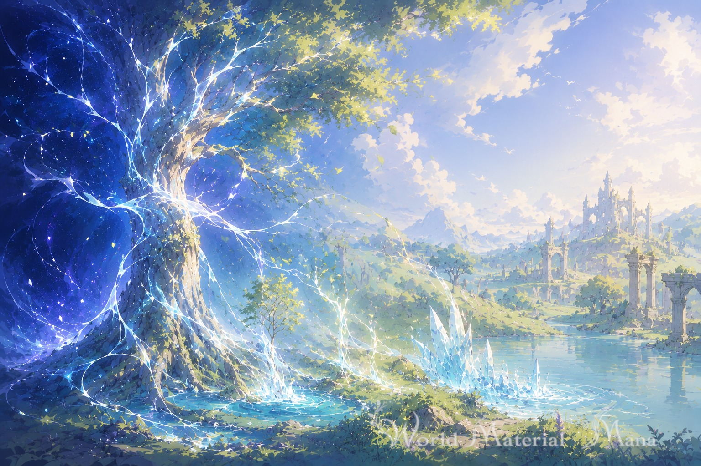

# World Material "Mana"

魔法が存在する世界の舞台設定ドキュメントです。物語・漫画・ゲーム・小説の土台として自由に使えます（条件は[ライセンス](#ライセンス)）。

***プレリリースです。FAQ と LLM セマンティック検証は試行中です。***

## どんな世界か

*イメージボード*

私たちの世界（**現界**）の裏側には、**真界**という別の次元があります。真界には、あらゆる物質・エネルギーのもとになる力 **マナ** が満ちています。心の力（**精神エネルギー**）がマナと共鳴すると、マナが物質やエネルギーに変わり、炎や氷となって現実に現れます。これがこの世界の「魔法」です。

この世界では、たとえば次のことが起こります。

- 自分の心の力で炎や氷を生み出したり、魔法や魔術で生まれた物をマナへ戻して消したりする（→ [魔法](world/magic.md)）
- 術式を組んで、同じ現象を誰が使っても起こせるようにする（→ [魔術](world/spellcraft.md)）
- マナを介さずに、心の力で他の個体やその魂へ直接はたらきかける（→ [超能力](world/psionics.md)）
- 自らの意思で力を保ち時代を越えて残る遺物や、人々の想いに支えられて力を持つ武具がある（→ [アーティファクト](world/artifacts.md)）
- 通常とは異なる環境や生態系が保たれた空間「ダンジョン」が生まれる（→ [ダンジョン](world/dungeons.md)）
- マナとの相性が異なる種族たちがいる（→ [種族](world/races.md)）
- 歴史は原初・神代・古代・人代と続き、魔法・魔術の担い手も時代とともに変わってきた（→ [魔法・魔術の歴史](world/magic-history.md)）
- 現代（人代）の文明は私たちの現実と同じ道筋をたどっており、魔法・魔術にはごく限られた者と秘匿組織だけが関わっている（→ [年表](world/timeline.md)）
- 宇宙の誕生（ビッグバン）そのものが、この世界で最大の魔法である（→ [共鳴現化 特殊事例: ビッグバン](world/core/theorems.md#特殊事例-ビッグバン)）

## この資料でできること

- **そのまま使う**: 世界の法則・種族・歴史を土台に、物語・漫画・ゲーム・小説を作れます
- **空白に答えを与える**: 死後の魂の行方や並行世界の有無など、この世界がわざと決めていない問いを「未解明領域」として確保しています。作品ごとに独自の答えを与えてかまいません（→ [未解明領域](world/core/open-questions.md)）
- **土台から作り替える**: 世界の根本ルールごと改変する場合に向けて、著者の選択と改変ポイントを整理しています（→ [著者の選択](docs/design-notes.md)）

## ドキュメントの構成

この世界設定は、世界の根本前提を**公理**として明示し、公理から導かれる世界の法則を**定理**として整理する形で書かれています。世界の根本ルール（コア）は次の 4 分類で整理されます。

- **公理 E（存在に関するもの）**: 何が存在するか（現界・真界・マナ・個体・魂・精神エネルギー）
- **公理 I（相互作用に関するもの）**: 何が起きうるか（変換則・共鳴則など）
- **定理（T）**: 公理から導出される世界の法則。魔法・魔術・超能力は、その行使のかたちへの命名としてここに置かれます
- **未解明領域（Q）**: 意図的に答えを決めていない空白。物語のための余白として体系内に確保されています

この 4 分類とは別に、具体的な中身（魔法・魔術・超能力・アーティファクト・ダンジョン・種族・歴史）は**応用**の各ファイルが担います。
前提が明示されているため、新しい設定を足すときも、既存の公理・定理との整合を確認しながら世界全体の一貫性を保てます。
導出構造の全体像と推奨される読み順は[導出構造マップ](world/README.md)を参照してください。

## 目次

### 世界設定

- [世界の法則 — 導出構造マップ](world/README.md) — 公理・定理・未解明領域の全体像と推奨読み順
- 世界の根本ルール
  - [公理](world/core/axioms.md)
  - [定理](world/core/theorems.md)
  - [未解明領域](world/core/open-questions.md)
- 具体的な中身
  - [魔法](world/magic.md) / [魔術](world/spellcraft.md) / [超能力](world/psionics.md)
  - [アーティファクト](world/artifacts.md) / [ダンジョン](world/dungeons.md)
  - [種族](world/races.md)
  - [年表](world/timeline.md) / [魔法・魔術の歴史](world/magic-history.md)
- [概念索引（glossary）](glossary.md)
- [FAQ](FAQ.md) — 具体的な場面で世界の法則がどう働くかの事例集（答えが一つに決まるか・わざと空けてあるか・両立しないかの判定つき。試行中）

### 設計ドキュメント

- [設計書（architecture）](docs/architecture.md) — ドキュメント群の構造・分類・記述規約
- [著者の選択（design-notes）](docs/design-notes.md) — 公準的事項・派生作品での改変ポイント
- [LLM セマンティック検証](docs/semantic-validation.md) — 具体ケースによる盲検の意味整合性検証（試行中）

## 作品の報告と設定への質問

この世界を使って作品を作ったら、GitHub Discussions の [Show and tell](https://github.com/nnnstett/WorldMaterial_Mana/discussions/categories/show-and-tell) で教えてください。ジャンルや規模は問いません。作品の報告はライセンスの条件ではありません。

設定の解釈で迷ったときは、[Q&A](https://github.com/nnnstett/WorldMaterial_Mana/discussions/categories/q-a) で質問できます。

## ライセンス

**クリエイティブ・コモンズ 表示 4.0 国際（CC BY 4.0）** で公開しています（[LICENSE.md](LICENSE.md)）。帰属表示を守れば、再利用・改変・商用利用・再頒布を自由に行えます。使用する場合は以下を記載してください。

- 作品名「World Material "Mana"」と使ったバージョン（またはリリースURL）
- 著作者（nnnstett）と著作権表記
- ライセンス名 CC BY 4.0（およびそのリンク）
- 改変した場合はその旨

記載の書き方の例は [LICENSE.md](LICENSE.md) を参照してください。

## リリースバージョン

- [ダウンロード](https://github.com/nnnstett/WorldMaterial_Mana/releases)
- [タグ一覧](https://github.com/nnnstett/WorldMaterial_Mana/tags)
