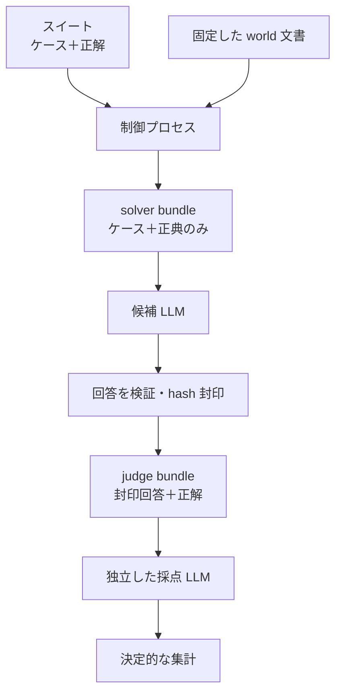

# LLM セマンティック検証

## 目的

既存チェッカーは、リンク・構造・分類・分量など、機械的に判定できる規約を保証する。
本方式はその外側にある「具体的な状況へ世界法則を適用したとき、結論が一意か、空白か、
矛盾か」を LLM で検証する。

LLM へリポジトリ全体を渡して「問題を探して」と依頼する方式は採らない。正解を見て回答を
合わせること、回答後に正解を書き換えること、採点者が候補回答を補完することを避けるため、
候補回答と採点を分離した盲検プロトコルを用いる。

## 信頼境界



候補 LLM が参照してよいものは `solver bundle` の中だけである。正典を読むことは検証対象の
推論に必要であり、カンニングではない。見せてはいけないものは oracle、元の case ID、過去の
回答、採点結果である。

## カンニング対策

### アクセス制御を主とする

「正解を見ないでください」というプロンプトはセキュリティ境界にならない。候補 LLM を API
で呼び出し、solver bundle の内容だけをメッセージへ含める方式が最も確実である。

Codex・Claude Code 等のファイルアクセス可能なエージェントを候補に使う場合、リポジトリを
作業ディレクトリにしてはいけない。solver bundle だけを別コンテナまたは VM へコピーし、
親ディレクトリ・非公開スイート・ネットワークを見せずに実行する。同一 OS ユーザーから読める
場所に oracle を置いたままでは、プロンプトで禁止しても盲検性は保証できない。

### 公開スイートを回帰指標として運用する

`semantic-tests/public/` は正解もリポジトリ管理する。改版のたびにケースと oracle をここへ
追加して蓄積し、版が変わっても結論が壊れていないかを追う回帰指標として使う。候補実行時に
リポジトリ、Web、過去セッションへのアクセスを遮断する運用では、通常の回帰スイートとして
使用できる。ケース集合を増やしても機械部分の自己テストは case 集合に依存しない設計のため、
追加のたびにテストを書き換える必要はない。

ただし、公開済み内容を学習済み・記憶済みのモデルに対する秘密性までは保証しない。この脅威も
対象にする場合のみ、リポジトリ外の非公開ディレクトリまたは別の private repository にスイートを
置く。

### 両側を開始時に固定する

`prepare-solver` は、正典、ケース（`ask`/`key` 双方）、suite 設定の SHA-256 を control manifest に
固定する。以後どれかが変更されると、回答封印・judge bundle 生成・採点は停止する。候補回答を見てから
`key`（正解側）を書き換えることはできない。

候補回答も構造検証後に SHA-256 で封印する。採点者は同じ hash を返さなければならず、採点中に
回答を改善・差し替えできない。

固定はソースの正典ファイルと author が書いたケースを基準にする。**control manifest・生成後の
solver bundle・封印済み回答そのものは、暗号署名で保護された成果物ではない**。これらを書き換えられる
主体は hash も付け替えられるため、control と suite は候補から隔離した保護領域に置き、solver bundle
は隔離・読み取り専用の環境でだけ候補へ渡す。改竄検知は誤配・偶発的なドリフトを止める仕組みであって、
ファイルを書き換えられる敵対者への防御ではない（防御の本丸はアクセス制御と隔離）。

### 候補と採点者を分離する

- 候補と採点者で会話履歴を共有しない
- 候補自身に自己採点させない
- 採点者へモデル名・候補の所属を知らせない
- 採点者は回答を補完せず、明示された内容だけを判定する
- 重要な実行では異なるモデル系列の採点者を奇数、原則 3 系統以上使う

採点 LLM は各 `must` 基準の `passed` と根拠だけを返す。合否はスクリプトが決定的に集計する:
**分類（`expect`）の一致をハードゲート**とし、加えて全 `must` が多数決で通過したときだけ `pass`。
分類不一致か `must` の落ちが一つでもあれば `fail`。同数票の基準は `needs_review` とする（採点者を
奇数にするため通常は生じない）。重み・critical は用いず、必要な論点はすべて `must` として並べる。

## スイート形式

```
suite/
├── suite.json
└── cases/
    └── *.json      # 1 ケース 1 ファイル（ask=候補に見せる / key=見せない）
```

`suite.json` は候補へ渡す正典ファイルを `source_paths` で明示する。ケースは 1 ファイルに集約し、
ツールが `ask`（候補に見せる）と `key`（見せない）を分離する。フィールドは次のとおり。

- `ask.facts` / `ask.question`: 候補に見せる状況と問い。期待結論や論点を含めない。
- `key.expect`: 期待する分類を 1 語で。`determinate` / `underdetermined` / `inconsistent`。
- `key.answer`: FAQ 用の一文の模範回答（採点には使わない。読者向けの言い換え）。
- `key.must[]`: 候補回答が満たすべき論点。`point`（採点対象の一文）と、任意の `from`
  （導出元の ID。採点には渡さず、FAQ 表示と、改訂時の影響範囲把握に使う）。

`must` の `point` は「模範解答と同じ文章」を要求せず、守るべき不変条件と、見落としてはならない
空白・衝突を書く。表現の一致ではなく意味を採点する。導出元を `point` の文字列に混ぜないのは、
候補が別の（等しく正しい）出典から導いたときに出典違いで減点されるのを避けるためで、`from` に分ける。

正典の範囲は検証目的に応じて固定する。

- **集中検証**: core 3ファイルと、対象ケースに必要な応用ファイルの依存閉包を渡す。失敗箇所を
  帰属しやすくし、無関係な具体例から答えを推測する余地を減らす。
- **横断検証**: core 3ファイルと `world/` 直下の応用本文をすべて渡す。領域間の衝突や、集中検証で
  落とした依存を検出する。

集中検証だけでは、選択時点で見落とした規則を検出できない。そのため `source_paths` は回答前に
全件列挙し、依存を閉じられないケースは横断検証へ送る。`docs/`、README、glossary、`FAQ.md`、Issue、PRは
世界設定本文ではなく、設計意図や要約・答えから期待答えを推測させるため、どちらの正典にも含めない。

`minimum_judges` は原則 `3` 以上の奇数にする。省略時は `3` である。

## 実行手順

以下の例ではリポジトリ管理スイートを使う。より強い秘密性が必要な場合だけ、`--suite` を
リポジトリ外の非公開スイートへ変える。

### 1. 候補用パックの生成

```sh
python3 scripts/semantic_eval.py prepare-solver \
  --suite semantic-tests/public \
  --out /tmp/mana-semantic/example/solver \
  --control /absolute/path/to/pj_root/work/semantic-runs/example/control.json \
  --candidate-deny-read /absolute/path/to/pj_root \
  --candidate-deny-read ~/.claude/projects
```

`control.json` は solver bundle に入らない。候補 LLM には `/tmp/mana-semantic/example/solver` だけを渡し、
`candidate-answer.schema.json` に従う回答を生成させる。
`--candidate-deny-read` を指定すると、候補 Claude Code 用の `candidate-settings.json` も生成される。

### 2. 候補回答の封印

```sh
python3 scripts/semantic_eval.py seal-answer \
  --suite semantic-tests/public \
  --control /absolute/path/to/pj_root/work/semantic-runs/example/control.json \
  --answer /tmp/mana-semantic/example/solver/candidate-answer.json \
  --out /absolute/path/to/pj_root/work/semantic-runs/example/sealed-answer.json
```

この時点で、case 数、匿名 case ID、引用可能な source、必須フィールド、開始時の
各 hash（正典と、ケースの `ask`/`key` 双方）が検査される。

### 3. 採点用パックの生成

```sh
python3 scripts/semantic_eval.py prepare-judge \
  --suite semantic-tests/public \
  --control /absolute/path/to/pj_root/work/semantic-runs/example/control.json \
  --sealed /absolute/path/to/pj_root/work/semantic-runs/example/sealed-answer.json \
  --out /absolute/path/to/pj_root/work/semantic-runs/example/judge
```

採点 LLM には judge bundle だけを渡す。同じ bundle を、会話履歴を共有しない複数の採点 LLMへ
独立に渡す。

### 4. 採点結果の集計

```sh
python3 scripts/semantic_eval.py score \
  --suite semantic-tests/public \
  --control /absolute/path/to/pj_root/work/semantic-runs/example/control.json \
  --sealed /absolute/path/to/pj_root/work/semantic-runs/example/sealed-answer.json \
  --judgment /absolute/path/to/pj_root/work/semantic-runs/example/judgment-a.json \
  --judgment /absolute/path/to/pj_root/work/semantic-runs/example/judgment-b.json \
  --judgment /absolute/path/to/pj_root/work/semantic-runs/example/judgment-c.json \
  --out /absolute/path/to/pj_root/work/semantic-runs/example/report.json
```

## FAQ の生成

ケースから読者向け `FAQ.md`（リポジトリ直下）を生成する。`key.answer` と `must`（導出元つき）を
出すので候補には渡さない。

```sh
make faq   # = python3 scripts/semantic_eval.py gen-faq --suite semantic-tests/public --out FAQ.md
```

ケースを追加・変更したら再生成してコミットする。`FAQ.md` がケースと同期しているかは `make test`
（`test_faq_in_sync`）で検査され、ずれると CI が赤になる。数が増えたら、この読みやすい `FAQ.md`
（や PR 上の差分）でレビューする。改訂時の影響範囲は、`must.from` に触れた ID を検索して洗い出す。

## ケース作成規則

良いケースは、一度に一つの意味境界を検査する。

- 規則をそのまま尋ねず、具体的な状況へ適用させる
- 結論に不要な事実を少量混ぜ、引用語の一致だけで答えられなくする
- 正典に存在しない数値を要求しない
- `determinate` だけでなく、意図した空白と意図しない未定義を含める
- 同じ論点を主語・順番・媒体だけ変えた変形ケースでも検査する
- `must` は**最終結論を含む論点を必ず1つ持つ**（`answer` は採点されないため、`answer` が `must` で被覆されないと、一般法則だけ述べて結論を外した回答が通ってしまう）
- `key`（特に `must`）はケース作成者とは別の人または別セッションの LLM が反証レビューする

少なくとも次の回帰群をスイートで持つ。

1. 現化の初期状態（位置・既存物質・温度・運動量）
2. 精神エネルギーの消費・拘束・回復
3. 裏付けの継続と供給源喪失
4. 物質・エネルギーの来歴混合
5. 瘴気の到達・優先結合・不活性化
6. 生体毒性
7. 同調・位相・抵抗
8. 人工物の同一性
9. 集合無意識と重複する上位個体
10. 転送と魂・履歴の連続

## CI での扱い

公開スイートを使う CI でも、solver bundle だけを外部 LLM API に送り、候補実行環境へリポジトリの
checkout path や認証情報を渡さない。非公開スイートを使う場合は、取得できる保護された CI ジョブ
で同じ分離を行う。

LLM の非決定性があるため、単発失敗を即座に文書の矛盾と断定しない。固定モデル・固定パラメータの
複数回実行、異種モデル、変形ケースで再現した失敗を設定上の finding とする。逆に、単発の合格も
整合の確証ではない（まぐれ合格がありうる）。重要な改訂は合格側も複数回で確認する。モデル更新時は
既知ケースの結果を基準にプロンプト互換性を再確認する。

## 任意の Claude Code Skills

別配布のClaude Code Skillをインストールした環境では、次の二段階の手順を実行できる。

- `/mana-start-semantic-test <検証したい状況> [scope=focused|integration] [solver_out=絶対パス] [run_out=絶対パス]`
  - ケースと oracle を先に固定し、候補へはケースと正典だけを渡して別Agentを起動する。
- `/mana-grade-semantic-test <control.jsonの絶対パス> [answer=絶対パス] [grade_out=絶対パス] [judges=奇数]`
  - 返却済み回答を封印し、独立した複数の採点Agentを並列起動して集計する。

`solver_out` は `pj_root` 外に置く。`run_out` と `grade_out` は既定で `pj_root/work/` 配下に置く。
