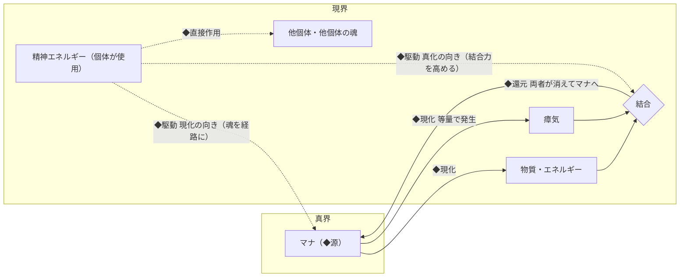
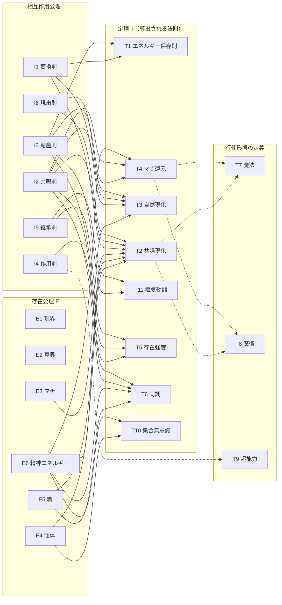

# 世界の法則 — 導出構造マップ

私たちの世界（**現界**）の裏側には、**真界**という別次元があり、そこに満ちる根源の力 **マナ** があらゆる現象の源になっている。心の力（**精神エネルギー**）がマナと共鳴すると、マナが物質やエネルギーに変わり、炎や氷となって現実に現れる。これがこの世界の「魔法」である。宇宙の誕生（ビッグバン）すら、この世界では一つの巨大な魔法として説明される（→ [共鳴現化 特殊事例: ビッグバン](core/theorems.md#特殊事例-ビッグバン)）。

この世界設定は、根本前提（**公理**）から世界の法則が論理的に導かれる体系として構成されている。公理は **存在に関するもの（E）** と **相互作用に関するもの（I）** に分かれ、そこから **定理（T）** が導かれ、代表的な行使のかたち（魔法・魔術・超能力）が **行使形態の定義** として名付けられる。さらに、意図的に答えを与えていない **未解明領域（Q）** を、物語のための空白として確保している。

このページは、その全体像・導出構造・推奨読み順を示す地図である。各命題の本文は [公理](core/axioms.md)・[定理](core/theorems.md)・[未解明領域](core/open-questions.md) を参照。

## 世界の概観

> **個体の精神エネルギーが駆動し、真界のマナが魂を通じて現界の物質・エネルギーへ変わる。同時に生じる瘴気がそれらをマナへ還し、精神エネルギーは別経路で他個体にも直接作用する世界。**

この一文は、次の 5 つの主要構造に分けられる。

| 構造 | 内容 | 主な公理 |
|---|---|---|
| **◆源** | あらゆる物質・エネルギーに変わりうるマナが、真界に存在する | [E2 真界]・[E3 マナ] |
| **◆駆動** | 個体が使用した精神エネルギーが、魂を経路としてマナの変換を駆動する。魂の形が変換先への適性を、大きさが一度に扱えるマナ量の上限を決める | [E4 個体]・[E5 魂]・[E6 精神エネルギー]・[I2 共鳴則] |
| **◆現化** | マナが現界へ出ると物質またはエネルギーとなり、同時に等量の瘴気が発生する | [I1 変換則]・[I3 副産則]・[I6 現出則] |
| **◆還元** | 瘴気が物質・エネルギーと結合し、両者が消えてマナへ戻る | [I3 副産則]・[I1 変換則] |
| **◆直接作用** | 精神エネルギーは、マナの変換を経ず他個体（およびその魂）にも作用できる | [I4 作用則] |

*図と表は要約であり、正確な内容は下の公理・定理の表と各本文が正である。*

## この体系から生まれるもの（例）

- 人が心の力で炎や氷を生み出す（→ [魔法](magic.md)・[魔術](spellcraft.md)）
- 意思を宿した伝説の武具（→ [アーティファクト](artifacts.md)）
- 通常とは異なる環境や生態系が保たれるダンジョン（→ [ダンジョン](dungeons.md)）
- マナとの相性（真度）が異なる種族たち（→ [種族](races.md)）

## 公理（存在に関するもの）

何が存在するか。

| 公理 | 概要 |
|---|---|
| [E1 現界](core/axioms.md#e1-現界) | 物理法則に従う 3 次元時空 |
| [E2 真界](core/axioms.md#e2-真界) | 現界とは別次元の空間。マナが存在する場 |
| [E3 マナ](core/axioms.md#e3-マナ) | 真界の純粋ポテンシャルエネルギー。あらゆる物理エネルギー・物質に変換可能 |
| [E4 個体](core/axioms.md#e4-個体) | 境界・持続性・一体性を備えたもの。ただの寄せ集め（総和）は個体でない。入れ子構造をとる |
| [E5 魂](core/axioms.md#e5-魂) | 個体ごとに固有の形を持つ、真界と現界の接点（孔） |
| [E6 精神エネルギー](core/axioms.md#e6-精神エネルギー) | 真度・位相・強さ・方向の 4 属性を持つエネルギー |

## 公理（相互作用に関するもの）

何が起きうるか。

| 公理 | 概要 |
|---|---|
| [I1 変換則](core/axioms.md#i1-変換則) | マナは現界に現出する瞬間、必ず物理エネルギーまたは物質に変換される |
| [I2 共鳴則](core/axioms.md#i2-共鳴則) | 精神エネルギーは共鳴により、マナと物質・エネルギーの相互変換を双方向に駆動する |
| [I3 副産則](core/axioms.md#i3-副産則) | マナの変換に伴い対となる瘴気がその場に発生し、結合してマナへ戻る |
| [I4 作用則](core/axioms.md#i4-作用則) | 精神エネルギーは他個体（およびその魂）にも作用しうる |
| [I5 継承則](core/axioms.md#i5-継承則) | 存在強度は物質・エネルギーの部分ごとに現に帯びられ、物理過程では変わらず受け継がれる |
| [I6 現出則](core/axioms.md#i6-現出則) | 生成物は、駆動した個体が知覚している場に、方向の定める状態で現れる（物質は既存の物質を押しのけて形を成す） |

## 定理

公理から導出される世界の法則（[T1 エネルギー保存則]〜[T6 同調], [T10 集合無意識], [T11 瘴気動態]）と、その行使のかたちへの命名である**行使形態の定義**（[T7 魔法]〜[T9 超能力]）。一部の定理は、強く結びつく短い帰結を本文中の**節**として持つ（独立 ID は付かない）。「概要」は専門語を避けた一行解説で、正確な本文は定理名のリンク先を参照。定理の番号は名前の一部であり、以下の表は番号の順ではなく読み流れの順に並ぶ。

### 導出される法則

| 定理 | 概要 | 導出元 | 重要な帰結（節） |
|---|---|---|---|
| [T1 エネルギー保存則](core/theorems.md#t1-エネルギー保存則) | マナ・物質・瘴気を合わせた総量は常に一定に保たれる | [I1 変換則] + [I3 副産則] | — |
| [T2 共鳴現化](core/theorems.md#t2-共鳴現化) | 魂を通した心の力がマナと共鳴し、物質やエネルギーが現実に現れる | [E4 個体] + [E5 魂] + [E6 精神エネルギー] + [I1 変換則] + [I2 共鳴則] + [I6 現出則] | [重要な帰結: 知覚の外への現化の不可能性](core/theorems.md#重要な帰結-知覚の外への現化の不可能性)・[特殊事例: ビッグバン](core/theorems.md#特殊事例-ビッグバン) |
| [T3 自然現化](core/theorems.md#t3-自然現化) | マナが濃すぎる場所で、心の力を介さずマナが現実へ染み出す | [E3 マナ] + [I1 変換則] + [I2 共鳴則] + [I6 現出則] | [危険性](core/theorems.md#危険性) |
| [T4 マナ還元](core/theorems.md#t4-マナ還元) | 瘴気が物質・エネルギーと結びつき、マナへ戻って真界に収まる | [I3 副産則] + [I2 共鳴則] + [E6 精神エネルギー] | [還元判定](core/theorems.md#還元判定)・[優先結合則](core/theorems.md#優先結合則) |
| [T11 瘴気動態](core/theorems.md#t11-瘴気動態) | 瘴気はその場に滞留してゆっくり動き、生成物がいつ・どこまで残るかを決める。運び出しは延命になっても恒久化にならない | [I3 副産則] + [I5 継承則] | [活性と不活性](core/theorems.md#活性と不活性)・[生成物の存続と移動](core/theorems.md#生成物の存続と移動) |
| [T5 存在強度](core/theorems.md#t5-存在強度) | 生成物が心の力を帯びた度合い（存在強度）で、何が消えて何が残るかが決まる | [I2 共鳴則] + [I3 副産則] + [I5 継承則] | [重要な帰結: ビッグバン由来物質の還元不可能性](core/theorems.md#重要な帰結-ビッグバン由来物質の還元不可能性) |
| [T6 同調](core/theorems.md#t6-同調) | 心の力が他個体の魂につながり、その魂を借りてマナの変換（現化・真化）を行う | [E5 魂] + [E6 精神エネルギー] + [I2 共鳴則] + [I4 作用則] | — |
| [T10 集合無意識](core/theorems.md#t10-集合無意識) | 社会・文化圏のような上位の個体も心の力（集合無意識）を生みうる。実際に、多くの想いが向く対象へはたらくことが観測されている | [E4 個体] + [E6 精神エネルギー] | — |

### 行使形態の定義

導出される法則ではなく、行使方法への命名（名前の定義）。

| 定義 | 概要 | 定義対象 |
|---|---|---|
| [T7 魔法](core/theorems.md#t7-魔法) | 自分の心の力で現実を変える術（詳細→[魔法](magic.md)） | [T2 共鳴現化]・[T4 マナ還元] の行使のうち、自身の精神エネルギーによるもの |
| [T8 魔術](core/theorems.md#t8-魔術) | 術式で誰でも同じ現象を起こせるようにした術（詳細→[魔術](spellcraft.md)） | [T2 共鳴現化]・[T4 マナ還元] の行使のうち、術式を介するもの |
| [T9 超能力](core/theorems.md#t9-超能力) | 自身の精神エネルギーを、マナの変換を経ず他個体（およびその魂）へ直接はたらかせる能力（詳細→[超能力](psionics.md)） | [I4 作用則] の接続・作用の行使 |

## 未解明領域

**Q は、あなたの作品が自由に物語を生み出すために「公式に空けてある余白」である。** 物語ギミックや派生作品での改変余地として体系内に意図的に確保されており、各作品が独自の答えを与えてよい。

| 未解明領域 | 意図された活用例 |
|---|---|
| [Q1 真度を人為的に深くする方法](core/open-questions.md#q1-真度を人為的に深くする方法) | 古代技術の再発見、原初返りの人工生成、組織の暗躍 |
| [Q2 意思を持つ道具・生成物の発生原理](core/open-questions.md#q2-意思を持つ道具生成物の発生原理) | 伝説の武具やダンジョンの核の独自来歴、新たな武具・ダンジョンの創出 |
| [Q3 真界の内部構造の詳細](core/open-questions.md#q3-真界の内部構造の詳細) | 異界探訪、真界からの干渉者 |
| [Q4 死後の魂の行方](core/open-questions.md#q4-死後の魂の行方) | 死霊・幽霊系の能力、転生 |
| [Q5 複数現界（並行世界）の有無](core/open-questions.md#q5-複数現界並行世界の有無) | 並行世界もの、異世界転移 |
| [Q6 マナの濃淡変動の長期周期性](core/open-questions.md#q6-マナの濃淡変動の長期周期性) | マナ枯渇・豊穣による時代区分 |
| [Q7 現界による宇宙生成の先行性](core/open-questions.md#q7-現界による宇宙生成の先行性) | 創世神話、上位存在、真界からの干渉 |
| [Q8 集合無意識の宛先機構](core/open-questions.md#q8-集合無意識の宛先機構) | 信仰・知名度が力になる伝説の武具、集合無意識を操る組織 |
| [Q9 複数の孔を持つ魂の発生原理](core/open-questions.md#q9-複数の孔を持つ魂の発生原理) | 転送を行使する桁違いの存在、複数孔の個体をめぐる争奪 |
| [Q10 真度の浅化の行く末](core/open-questions.md#q10-真度の浅化の行く末) | 浅化の下限・速度の数値化、浅化が臨界に達する終末時計 |
| [Q11 太古の出来事が後代の神話に滲む機構](core/open-questions.md#q11-太古の出来事が後代の神話に滲む機構) | 現実の神話に混じる本物の残響、残響を読む能力者・組織、偽の残響をめぐる策略 |
| [Q12 転送が還元不可能性に抵触しない機構](core/open-questions.md#q12-転送が還元不可能性に抵触しない機構) | 転送（ワープ）を成り立たせる独自機構の考案、桁違いの存在の演出 |
| [Q13 不活性瘴気の再活性化](core/open-questions.md#q13-不活性瘴気の再活性化) | 眠る膨大な瘴気在庫という背景圧力、再活性化を引き金にした危機・事件 |
| [Q14 超能力の発現条件](core/open-questions.md#q14-超能力の発現条件) | 能力者の出自・覚醒条件の自由設計、感応系の素養者を探す組織 |
| [Q15 上位個体（社会・国家など）の魂と意思の観測可能性](core/open-questions.md#q15-上位個体社会国家などの魂と意思の観測可能性) | 国家との同調・都市の意思・土地神型の設定、国家の魂への接続を試みる組織 |
| [Q16 人工物の本質部品の判定](core/open-questions.md#q16-人工物の本質部品の判定) | 名刀のテセウスの船論争、折れた聖剣の再鍛造の真贋、自らの同一性を主張する意思ある道具 |
| [Q17 個体化の下限（どこからが一つのまとまりか）](core/open-questions.md#q17-個体化の下限どこからが一つのまとまりか) | 土地・群れ・共同体が「魂を持つ一個の個体」になる線引きの自由設計、信じられることで個体に成る土地神・都市の意思 |

## 役割ラベルの凡例

[公理](core/axioms.md)は「魂」「マナ」のような概念ごとの**公理群**で、「公理」として番号付きで並ぶ文の一つひとつが公理である。公理・[定理](core/theorems.md)の本文はそのあと、役割ごとの太字の区分（**定義**・**観測事実**・**目安**・**補足**・**空白**）に分かれて記される。次の表は、それぞれを「どこまで動かしてよいか」の目印である。おおまかに上の行ほど固く、下の行ほど自由になる（正確な扱いは各行の右列が正）。

| 種類 | やさしく言うと | 意味と扱い方 |
|---|---|---|
| **公理**（番号付きの文） | 世界の土台 | この世界の動かない骨格。矛盾する設定・物語は作れない（土台ごと作り替える派生作品の指針は [design-notes](../docs/design-notes.md) を参照） |
| **定義** | 言葉の意味 | 用語の意味はここが正。呼び方を変えても意味は保つ |
| **観測事実** | そう観察されていること | 理由まではわかっていない、観察された事実。傾向や頻度には例外を描いてよいが、仕組みや「まだ見つかっていない例」を勝手に正解として確定させない（例: 起きる頻度を少し変えるのはよいが、なぜ起きるかを勝手に決めない）。一回性の出来事（例: ビッグバンが「現界」の魔法だったこと）は、出来事そのものは正史として確定しており、機構・意味づけの解釈は自由 |
| **目安** | だいたいの値 | 幅のある数値・規模。個々の描写では上下してよいが、桁ごと変えるのは設定の改変になる |
| **補足** | 理解を助ける説明 | 説明・例え・関連ページへの案内。物語を縛らないが、矛盾の根拠にもしない |
| **空白** | わざと決めていないこと | [未解明領域](core/open-questions.md)（Q）への入り口。あなたの作品が自由に答えを与えてよい。ただし公式の正解は一つに決まっていない |

- この凡例は主に、この世界で物語を作る人向けの目印である。まず雰囲気を掴みたいときは「やさしく言うと」の列だけで足りる
- 各公理群の見出し直下にある無ラベルの 1〜2 文は、その群の要点をやさしくまとめた**要約**である。拘束力を持つのは番号付きの公理と役割の区分であり、要約はそれらの言い換えにすぎない
- **関連**は他の命題・応用ページへの案内であり、動かす対象ではない
- 空白ラベルは Q の入り口の一部にすぎない。Q の全体は上の[未解明領域](#未解明領域)の表が一覧であり、各命題の「関連」からもたどれる
- 定理の**詳細**の箇条は、「命題・導出元から導かれる内容」を示す。役割の区分は、定理でもエントリ直下と節の中のそれぞれで用いられる
- 定理の**証明スケッチ**は導出の筋を示すもので、読み飛ばしても本文は読める
- [T7 魔法]〜[T9 超能力] は導出される法則ではなく**行使形態の定義**であり、命題・証明スケッチの代わりに**定義**・**定義対象**の区分を持つ

## 導出構造

公理（存在 E・相互作用 I）から定理（T）が導かれ、一部の定理は重要な帰結を節として分岐させる。未解明領域（Q）は各命題に関連づく空白として体系の各所に配置される。

**導出の例**: マナが現界に現れる瞬間、必ず物理エネルギーか物質に変わり（[変換則](core/axioms.md#i1-変換則)）、同時に対となる瘴気が生じる（[副産則](core/axioms.md#i3-副産則)）。生成と副産が必ず対になるため差し引きの総量は変わらない——こうして [エネルギー保存則](core/theorems.md#t1-エネルギー保存則) が導かれる。

*図は導出関係の全体を示す。正確な導出元と重要な帰結（節）は上の定理の表が正である。*

## 応用ドキュメント

「主な導出元」は、各応用ファイル冒頭の「前提」に挙げた公理・定理を抜粋したもの。

| ドキュメント | 主な導出元 |
|---|---|
| [魔法](magic.md) | [T7 魔法]、[T2 共鳴現化]、[T4 マナ還元] |
| [魔術](spellcraft.md) | [T8 魔術]、[T2 共鳴現化]、[T4 マナ還元] |
| [超能力](psionics.md) | [T9 超能力]、[I4 作用則] |
| [アーティファクト](artifacts.md) | [T5 存在強度]、[T10 集合無意識]、[T2 共鳴現化]、[T4 マナ還元] |
| [ダンジョン](dungeons.md) | [T2 共鳴現化]、[T5 存在強度]、[I3 副産則]、[T4 マナ還元]、[T11 瘴気動態]、[E6 精神エネルギー] |
| [種族](races.md) | [E5 魂]、[E6 精神エネルギー]、[T6 同調] |
| [年表](timeline.md) | 世界の法則全般 |
| [魔法・魔術の歴史](magic-history.md) | [T7 魔法]、[T8 魔術]、[Q1 真度操作] |

## 推奨読み順

### 体系的理解パス（全体を通して理解したい方向け）

1. [公理](core/axioms.md) — 存在（E）と相互作用（I）の根本前提を通読
2. [定理](core/theorems.md) — 公理から導かれる世界の法則
3. [未解明領域](core/open-questions.md) — 意図的に残された空白
4. [魔法](magic.md) → [魔術](spellcraft.md) → [超能力](psionics.md) — 能力体系の詳細
5. [アーティファクト](artifacts.md) → [ダンジョン](dungeons.md) — 物質・空間の応用
6. [種族](races.md) → [年表](timeline.md) → [魔法・魔術の歴史](magic-history.md) — 世界の住人と歴史

### 早引きパス（特定の概念を確認したい方向け）

- [概念索引（glossary）](../glossary.md) から概念名で検索し、出典リンクをたどる
- このページの公理一覧・定理一覧・未解明領域一覧の表からも、各 ID のリンクで直接本文へたどれる

### 物語利用者パス（物語・ゲーム・漫画に使いたい方向け）

1. このページの公理一覧・定理一覧・未解明領域一覧で全体像を把握
2. [魔法](magic.md) / [魔術](spellcraft.md) / [超能力](psionics.md) で戦闘・能力のルールを確認
3. [種族](races.md) でキャラクター設計の制約を確認
4. [年表](timeline.md) で物語の時代背景を選択
5. 改変ポイント（著者の選択）は [design-notes](../docs/design-notes.md) を参照

---

<!-- リンク参照定義（shortcut reference 形式）。world/README.md からの相対パスで記述する。 -->

[E1 現界]: core/axioms.md#e1-現界
[E2 真界]: core/axioms.md#e2-真界
[E3 マナ]: core/axioms.md#e3-マナ
[E4 個体]: core/axioms.md#e4-個体
[E5 魂]: core/axioms.md#e5-魂
[E6 精神エネルギー]: core/axioms.md#e6-精神エネルギー

[I1 変換則]: core/axioms.md#i1-変換則
[I2 共鳴則]: core/axioms.md#i2-共鳴則
[I3 副産則]: core/axioms.md#i3-副産則
[I4 作用則]: core/axioms.md#i4-作用則
[I5 継承則]: core/axioms.md#i5-継承則
[I6 現出則]: core/axioms.md#i6-現出則

[T1 エネルギー保存則]: core/theorems.md#t1-エネルギー保存則
[T2 共鳴現化]: core/theorems.md#t2-共鳴現化
[T3 自然現化]: core/theorems.md#t3-自然現化
[T4 マナ還元]: core/theorems.md#t4-マナ還元
[T5 存在強度]: core/theorems.md#t5-存在強度
[T6 同調]: core/theorems.md#t6-同調
[T10 集合無意識]: core/theorems.md#t10-集合無意識
[T11 瘴気動態]: core/theorems.md#t11-瘴気動態
[T7 魔法]: core/theorems.md#t7-魔法
[T8 魔術]: core/theorems.md#t8-魔術
[T9 超能力]: core/theorems.md#t9-超能力

[Q1 真度操作]: core/open-questions.md#q1-真度を人為的に深くする方法
[Q2 意思を持つ道具・生成物]: core/open-questions.md#q2-意思を持つ道具生成物の発生原理
