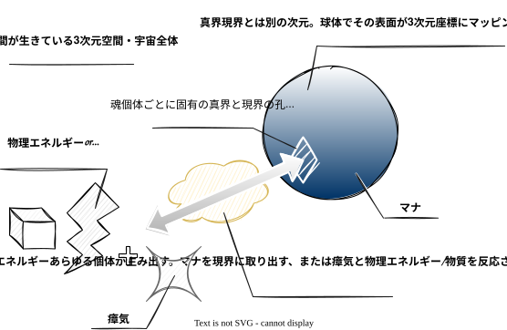

# 公理

本書は World Material "Mana" の**公理**を定義する。公理は世界の根本前提であり、ここから[定理](theorems.md)が論理的に導出される。

公理は 2 種類に分かれる。

- **存在に関する公理（E）** — 何が存在するか
- **相互作用に関する公理（I）** — 何が起きうるか

導出構造の全体像と推奨読み順は [world/README.md](../README.md) を参照。まず雰囲気をつかむには、各見出し直下の**要約**（無ラベルの 1〜2 文）だけを拾い読みすればよい。各公理は概念ごとの**公理群**であり、「公理」として番号付きで並ぶ文の一つひとつが、この世界の動かない根本前提である。要約は読みやすさのための言い換えであり、動かせない内容は番号付きの公理と役割ごとの区分が定める。役割ごとの区分（**定義**・**観測事実**・**目安**・**補足**・**空白**）は、その記述をどこまで動かしてよいかを示す。凡例は [world/README.md「役割ラベルの凡例」](../README.md#役割ラベルの凡例) を参照。

*図: 真界のマナが魂（孔）を通り、精神エネルギーの共鳴によって現界へ物質・物理エネルギーとして現出する様子。各用語は本書で順に定義する。*

---

## 存在に関する公理

### [E1] 現界

物理法則に従う 3 次元時空（現界）が存在し、個体の存在する場となっている。そこでは、真界との関係で機能する特有の法則——マナ・精神エネルギー・魂——も働く。

**公理**（[凡例](../README.md#役割ラベルの凡例)）:
1. 現界は、物理法則に従う 3 次元時空であり、重力をはじめとする物理法則が働く 
2. 現界は、個体（[E4 個体]）が存在する場である 
3. 現界には、真界（[E2 真界]）との関係で機能する特有の法則——マナ（[E3 マナ]）・精神エネルギー（[E6 精神エネルギー]）・魂（[E5 魂]）——が存在する 

**補足**:
- 物理法則は本作の枠組みに必要な範囲で言及し、詳細は読者の物理直感に委ねる

**空白**:
- 別の現界（並行世界）が存在するかは未解明である（→ [Q5 並行世界]）

**関連**:
- → [E2 真界], [E4 個体], [E7 物質・物理エネルギー], [I1 変換則], [T1 エネルギー保存則], [Q5 並行世界]

---

### [E2] 真界

現界とは独立した別次元の空間（真界）が存在し、マナの場として現界の各場所と対応している。内部のマナには濃淡があり、その総量は膨大である。

**公理**（[凡例](../README.md#役割ラベルの凡例)）:
1. 真界は、現界（[E1 現界]）の 3 次元空間とは独立した次元である 
2. 真界は、マナ（[E3 マナ]）が存在する場である 
3. 現界のどの場所にも、対応する真界の領域がある（現界の 3 次元座標と対応する） 
4. 真界の内部ではマナに濃淡があり、自然には緩慢にしか変動しない。現化（マナが現界に現れること）や真化（物質・物理エネルギーがマナへ還ること）による変動はこの限りではない（→ [I2 共鳴則], [T3 自然現化], [T4 真化]） 
5. マナの総量は膨大である（真界 》 宇宙全体のエネルギー 》 惑星単体のエネルギー） 

**目安**:
- マナの濃淡の自然変動は、数千〜数万年単位のスケールである

**補足**:
- 現界との対応のイメージは「球体の表面の各点が、現界の各場所に対応する」。球の内側にあたる部分が、真界の内部（→ [Q3 真界の内部構造]）である

**空白**:
- 内部構造の詳細は未解明である（→ [Q3 真界の内部構造]）

**関連**:
- → [E1 現界], [E3 マナ], [E5 魂], [Q3 真界の内部構造], [Q6 マナ濃淡変動]

---

### [E3] マナ

真界には、あらゆる物理エネルギー・物質に変換可能な純粋ポテンシャルエネルギー（マナ）が存在する。その局所的な濃度は、魂を通してそこで引き出せる量と効率を制約し、極端に高まると魂の孔を通らず現界へ染み出す。

**公理**（[凡例](../README.md#役割ラベルの凡例)）:
1. 真界（[E2 真界]）には、あらゆる物理エネルギー・物質（[E7 物質・物理エネルギー]）に変換可能な純粋ポテンシャルエネルギー（マナ）が存在する 
2. 局所的なマナ濃度（→ [E2 真界]）は、魂（[E5 魂]）を通してそこで引き出せるマナの量と効率（→ [I2 共鳴則]）を制約する 
3. 真界の局所濃度が極端に高くなると、マナは魂（[E5 魂]）の孔を通らずとも、溢れるように現界へ染み出す。この染み出しに方向づけはない（→ [T3 自然現化]） 

**定義**:
- **純粋ポテンシャルエネルギー**: まだ姿が決まっておらず、あらゆる物理エネルギー・物質に変わりうる「可能性」そのもの

**関連**:
- → [E2 真界], [E5 魂], [E7 物質・物理エネルギー], [I1 変換則], [I2 共鳴則], [T3 自然現化], [Q6 マナ濃淡変動]

---

### [E4] 個体

現界には、周りと区切られ（境界）、途切れず続き（持続性）、ばらばらの寄せ集めではなく一つにまとまった（一体性）個体が、入れ子構造で存在する。寄せ集めただけの集合は一体性を欠き、個体ではない。

**公理**（[凡例](../README.md#役割ラベルの凡例)）:
1. 現界には、境界（他と区別される輪郭）・持続性（履歴の連続）・一体性（単なる寄せ集めではなく一つであること）の 3 要件を備えたもの（個体）が存在する 
2. 個体は入れ子構造をなす。上位の個体は下位の個体の単純な総和ではなく、それ自体が一個の独立した個体である 
3. 個体は精神エネルギー（[E6 精神エネルギー]）を帯びる。発生量と「使用」の可否は意思の有無に依る（→ [E6 精神エネルギー]） 
4. 最大の個体は現界（[E1 現界]）である。現界は宇宙（物質・物理エネルギーの全体。→ [E7 物質・物理エネルギー]）を内に含む一つの個体であり、意思を持ち、精神エネルギーを使用できる 
5. 個体は固有の魂（[E5 魂]）を持つ 

**定義**:
- **境界**: 他と区別される輪郭。物理的な輪郭に限らず、社会のような個体では成員のつながり・制度が輪郭をなす
- **持続性**: その個体として**途切れず在り続ける**こと＝履歴の連続。構成要素の物理的な連続は要求しない。構成要素が入れ替わっても、入れ替わりが存続している当の個体の中で起きている限り、履歴は途切れない（例: 細胞が入れ替わり続けても、人は同一の個体である）
- **一体性**: 構成要素の総和にとどまらず、それ自体で一つであること。構成要素が溶け合うことを求めず、個々がそのまま残っていても全体として一つにまとまっていればよい
- **同一性**: 機能・役割の同一性では決まらない。同じ位置で同じ働きをする別の個体は、履歴が元の個体を通っていないため、元の個体ではない
- **総和**: 構成要素をただ足し合わせただけの全体（ただの寄せ集め）
- **生成時**: 個体が 3 要件を初めて備え、個体として成立する時点

**補足**:
- 規模の幅は極めて広い。入れ子構造の例（「⊂」は左が右に含まれる印）: 細胞 ⊂ 人 ⊂ 社会 ⊂ 国家 ⊂ 地球 ⊂ 宇宙 ⊂ 現界（社会・国家のような中間の集まりをどこから個体とみなすかは未解明。→ [Q17 個体化の下限]）
- 社会・文化圏のように緩く結びついた集まりも、一体性を備えていれば個体である（集合無意識（→ [T10 集合無意識]）や存在強度の支え（→ [T5 存在強度]）は、これが個体であることに依る）
- 個体でない例: たまたま居合わせた群衆（持続性を欠く）、岩と隣の木をまとめただけの集合（持続しても一体性を欠き、総和にとどまる）。総和にとどまる集合は、全体として宿る固有の魂（→ [E5 魂]）も持たない
- 現界を一つの個体とみなす見方は、ガイア理論（地球を一つの生命体とみなす考え方）を現界全体へ広げたものである（その最大の帰結——宇宙の誕生——は → [T2 共鳴現化]）

**空白**:
- 一体性の下限（どこからが一個の個体か）は未解明である（→ [Q17 個体化の下限]）
- 社会・国家のような上位個体について、その魂・意思を観測・利用できるかは未解明である（→ [Q15 上位個体の魂と意思]）
- 現界が生成時に魂・精神エネルギーをどう備えたかは未解明である（→ [Q7 現界による宇宙生成の先行性]）

**関連**:
- → [E1 現界], [E5 魂], [E6 精神エネルギー], [E7 物質・物理エネルギー], [T2 共鳴現化], [T5 存在強度], [Q7 現界による宇宙生成の先行性], [Q15 上位個体の魂と意思], [Q17 個体化の下限], [spellcraft.md]

---

### [E5] 魂

個体ごとに固有の形を持つ、真界と現界の接点（魂）が存在する。

**公理**（[凡例](../README.md#役割ラベルの凡例)）:
1. 魂は真界（[E2 真界]）と現界（[E1 現界]）をつなぐ「孔」として働く 
2. 魂は個体ごとに固有の**形**を持つ。形は変換先への適性（得意分野）として共鳴の効率を左右する（共鳴の仕組みと変換先の決定は → [I2 共鳴則]） 
3. 魂の形は系譜を写す（血筋・系統に沿って受け継がれる） 
4. 魂は個体ごとに固有の**大きさ**を持ち、一度に扱えるマナ量の上限を決める 
5. 魂の大きさは個体の生成時（→ [E4 個体]）に定まり、以後変化しない 
6. 人工の個体（道具など）の魂は製作の過程で刻まれ、その大きさは製作に動員された魂に制約される（→ [spellcraft.md]） 
7. 魂は原則として個体と 1 対 1 で結びつくが、条件次第で他個体の魂にもアクセスしうる。このアクセスは、魂が持つ「孔」としての機能に及ぶ（→ [T6 同調]） 

**観測事実**:
- **孔の数**: 魂の孔は通常 1 つである。ごく例外的に複数の孔を持つ魂が観測され、その発生原理は未解明である（→ [Q9 複数孔の魂]）
- 自然に生じた個体では、大規模な個体（地球・惑星）ほど大きな魂を持つ傾向がある

**空白**:
- 死後の魂の行方は未解明である（→ [Q4 死後の魂]）

**関連**:
- → [E4 個体], [E6 精神エネルギー], [T2 共鳴現化], [T6 同調], [Q4 死後の魂], [Q9 複数孔の魂], [Q15 上位個体の魂と意思], [spellcraft.md]

---

### [E6] 精神エネルギー

個体は心の働きに伴って、真度・位相・強さ・方向の 4 属性を持つエネルギー（精神エネルギー）を発生させる。発生量は意思を持つ個体ほど多く、未使用の分は容量の上限まで個体の内に留まり、使用された分は消費されて戻らない。

**公理**（[凡例](../README.md#役割ラベルの凡例)）:
1. 精神エネルギーは心の働き（思考・感情・欲求の活動）に伴って発生する。特定の器官にはよらず、発生量は意思を持つ個体ほど多い 
2. 意思を持たない個体（道具・鉱物など）でも、存在を保つこと（境界と持続性の維持。→ [E4 個体]）に伴って微量が発生する 
3. 発生してまだ使用されていない精神エネルギーは、その個体の内（境界の内側。→ [E4 個体]）に留まる。留めていられる量の上限（容量）を超えた分は霧散し、意思を持たない個体ではこの容量はごく小さい 
4. 使用された精神エネルギーは、その働き（共鳴・作用。→ [I2 共鳴則], [I4 作用則]）に消費され、発生元に戻ることも、再び使用されることもない 
5. 容量は鍛錬で増えるが、生得の限界を超えない 
6. 精神エネルギーは、真度（マナ・瘴気との共鳴のしやすさ）・位相（個体ごとの波の紋様）・強さ（濃さ）・方向（変換先の傾き）の 4 属性を持つ 
7. 個体が生まれ持つ真度は、宇宙のルーツ（宇宙の起源・原初）に近いほど深く、原則として変化しない 
8. 個体が生まれ持つ位相は系譜を写し、変化しない 
9. 強さは、意思の強さ・知性の深さに依存する 
10. 変換の方向は、個体自身の方向性（その個体の性質・営みの傾き）に強く引っ張られる 

**定義**:
- **真度**: 深い（真界寄り）〜浅い（現界寄り）の連続的なグラデーション。マナまたは瘴気との共鳴のしやすさを決める（→ [I2 共鳴則]）。種族・個体ごとの目安は [races.md「真度の目安」](../races.md#真度の目安) を参照
- **位相**: かみくだけば「チャンネル」。個体ごとに固有の、波の紋様。位相が近い（合う）個体ほど、魂への接続（→ [I4 作用則], [T6 同調]）が成立しやすい
- **強さ**: 精神エネルギーの濃さ（量とは直交する、質の属性）
- **方向**: 変換時にマナがどのエネルギー・物質へ向かうか（変換先）を決める属性。変換先の指定がどこまでの状態に及ぶかは → [I6 現出則]
- **使用**: 意思によって精神エネルギーに方向づけを与えること。ここでの意思は欲求・衝動の水準でよく、無意識的・本能的な使用も含む（例: 魔物の本能的な魔法行使。→ [races.md]）。使用された精神エネルギーが共鳴・作用の担い手となる（→ [I2 共鳴則], [I4 作用則]）
- **容量**: 個体が精神エネルギーを留めていられる量の上限（エネルギーの属性ではなく、個体の側の性質）

**観測事実**:
- **原初返り**: 進化を経た種族から、特異的にルーツが近い深い真度を持つ個体が生まれることがある（原初返り）。人代（現代にあたる時代区分。→ [timeline.md]）では 1 世代に 2〜3 人程度の頻度で発生し、その発生メカニズムは未解明である（→ [Q1 真度操作]）

**目安**:
- 人型の個体の平均では、万全な状態なら、空の状態から 1 日（24 時間）で容量の 8 割ほどまで回復する

**補足**:
- 消費された分が戻ることはないが、発生は心の働きが続くかぎり続き、留めている量は容量まで再び満ちていく
- 位相は魂（[E5 魂]）の形と同じく系譜を写すため、系統が近い個体ほど位相も近く、形と位相は相関する傾向がある。ただし互いに独立に揺らぎうるため、一致するとは限らない
- 真度・位相の生得値を変えずに、行使中だけ一時的にずらすシフト（術式による）は → [I2 共鳴則]

**空白**:
- 真度を人為的に深くする方法は未解明である（→ [Q1 真度操作]）

**関連**:
- → [E4 個体], [E5 魂], [I2 共鳴則], [I4 作用則], [T2 共鳴現化], [T5 存在強度], [T10 集合無意識], [Q1 真度操作], [spellcraft.md], [artifacts.md]

---

### [E7] 物質・物理エネルギー

現界には、実体として物質と物理エネルギーが存在する。どちらも現界の物理法則に従ってふるまい、どれだけ消えにくいかの度合い（存在強度）を持つ。

**公理**（[凡例](../README.md#役割ラベルの凡例)）:
1. 現界（[E1 現界]）には、物質と物理エネルギーが存在する 
2. 物質・物理エネルギーは、現界に働く物理法則（→ [E1 現界]）に従ってふるまう。マナとの変換の瞬間（→ [I1 変換則]）は、この限りではない 
3. 存在強度（精神エネルギーの裏付けを受けている度合い）は、物質・物理エネルギーのそれぞれの部分が、いま帯びている値である。一つの物体や構造の内部でも、部分ごとに異なる存在強度が共存しうる 

**定義**:
- **物質**: 固体・液体・気体などとして場所を占める実体。現実世界の物質と同じものを指す
- **物理エネルギー**: 力学・電磁気・熱・化学・光/放射線・核の各エネルギーの総称。現実世界の物理エネルギーと同じものを指す
- **存在強度**: 物質・物理エネルギーが、精神エネルギーの裏付け（→ [I2 共鳴則]）を受けている度合い

**補足**:
- 物理的に見分けのつかない原子や粒子のあいだでも、帯びる存在強度は異なりうる。存在強度の違いは、物としての同一性や個体の区別（[E4 個体]）とは別の軸である

**関連**:
- → [E1 現界], [E3 マナ], [E4 個体], [E6 精神エネルギー], [I1 変換則], [I2 共鳴則], [I3 副産則], [I5 継承則], [I6 現出則], [T1 エネルギー保存則], [T5 存在強度]

---

## 相互作用に関する公理

### [I1] 変換則

マナが現界に現出する瞬間、必ず物理エネルギーまたは物質に変換され、その変換は量を保つ。共鳴を経ない現出に方向づけはない。

**公理**（[凡例](../README.md#役割ラベルの凡例)）:
1. マナ（[E3 マナ]）が現界に現出する瞬間、必ず物理エネルギーまたは物質（[E7 物質・物理エネルギー]）に変換される。マナのままでは現界に存在できない 
2. 変換は量を保つ。これは、マナから物質・物理エネルギーと対の瘴気（マナ変換で必ず生じる副産物。→ [I3 副産則]）が生まれる現出でも、物質・物理エネルギーと瘴気がマナへ還る逆向きの変換でも成り立ち、失われた側と生まれた側の総量は等しい（→ [T1 エネルギー保存則]） 
3. 共鳴（→ [I2 共鳴則]）を経ない現出（→ [E3 マナ], [T3 自然現化]）では方向づけがなく、確率的である 

**補足**:
- 量の単位や数値は定めず、大小と釣り合いの関係だけを用いる。物質・物理エネルギー・マナ・瘴気は共通の「量」の物差しで数え、物質と、その物質を形づくっているエネルギーを二重に数えることはしない（温度や運動として帯びる分は別に数える。→ [I6 現出則]）
- 収支の見方: 1 の物質・物理エネルギーが現出すると対の瘴気も 1 生じ（瘴気は生成物と等量で生じる。→ [I3 副産則]）、あわせて 2 のマナが減る。逆向きの変換では、物質・物理エネルギー 1 と瘴気 1 が消えて 2 のマナが真界へ戻る

**関連**:
- → [E3 マナ], [E7 物質・物理エネルギー], [I2 共鳴則], [I3 副産則], [I6 現出則], [T2 共鳴現化], [T3 自然現化]

---

### [I2] 共鳴則

精神エネルギーは共鳴により、マナと物質・物理エネルギーの相互変換を双方向に駆動する。現化の生成物は駆動した精神エネルギーの裏付けを宿し、裏付けは供給が続く間だけ保たれる。

**公理**（[凡例](../README.md#役割ラベルの凡例)）:
1. 精神エネルギー（[E6 精神エネルギー]）は変換そのものではなく、変換を駆動する 
2. 変換先（何になるか）は、使用された精神エネルギーの方向が決める（→ [E6 精神エネルギー]）。共鳴の効率は、個体の側では真度・変換先と個体の方向性との整合・魂（[E5 魂]）の形の適合度で決まる（場の側の制約は → [E3 マナ]） 
3. 共鳴の働きの大きさは、使用された精神エネルギーの量と強さに応じて増す。量が同じでも、強さが高いほど大きい 
4. 共鳴の相手は向きによって異なる。マナを引き出す向き（現化。→ [T2 共鳴現化]）では**マナ**と、物質・物理エネルギーをマナへ還す向き（真化。→ [T4 真化]）では**瘴気**（マナ変換の副産物。→ [I3 副産則]）と噛み合う 
5. 真化の向きの共鳴は、瘴気の結合力（瘴気を結合へ向かわせる働き。→ [I3 副産則]）を高める 
6. 真界寄り（深い真度）ほどマナと、現界寄り（浅い真度）ほど瘴気と共鳴しやすい 
7. 駆動するのは、**使用**（意思による方向づけ。→ [E6 精神エネルギー]）された精神エネルギーに限る。使用されない精神エネルギー（意思を持たない個体が帯びる微量分など）はマナと共鳴しない（→ [T3 自然現化]） 
8. 共鳴を経てマナから現出した物質・物理エネルギー（現化の生成物。→ [T2 共鳴現化]）は、駆動した精神エネルギーの影響＝**裏付け**を宿す（裏付けの度合いが存在強度である。→ [E7 物質・物理エネルギー]） 
9. 裏付けの度合いは、精神エネルギーの強さを主要因とし、変換先と方向の整合・魂（[E5 魂]）の形の適合度が副次的に効く。真度・位相は影響しない 
10. 裏付けは、生成した個体が新たな精神エネルギーを使用して支え続ける（供給）間は保たれ、供給が絶えると時とともに弱まる。強い裏付けほど弱まりは遅い 
11. 精神エネルギーの属性は、外部の仕組み（術式など。→ [T8 魔術]）を介して、行使中に限り一時的にシフト可能である（→ [E6 精神エネルギー]）。シフトは損失を伴い、シフトを経た精神エネルギーの共鳴の働きはそのぶん小さくなる 

**目安**:
- 人型の個体の平均的な強さによる裏付けは、供給がなければ秒単位で弱まる

**補足**:
- 真度と共鳴相手の対応は、マナが真界（[E2 真界]）に、瘴気が現界（→ [I3 副産則]）に在るという対称性の現れであり、これにより向きごとの得手（深い＝現化／浅い＝真化）が分かれる
- 真度・位相が左右するのは、共鳴の効率や魂への接続のしやすさ（→ [I4 作用則]）であり、生成物の裏付けの度合いではない。どれだけ変換できるか（効率）と、生成物がどれだけ強く保たれるか（裏付け）は、別の量である
- 裏付けは影響であってエネルギーの蓄えではない。生成物や対象から精神エネルギーとして取り出すことはできない

**関連**:
- → [E2 真界], [E3 マナ], [E5 魂], [E6 精神エネルギー], [E7 物質・物理エネルギー], [I1 変換則], [I3 副産則], [I5 継承則], [I6 現出則], [T2 共鳴現化], [T4 真化], [T5 存在強度], [T8 魔術]

---

### [I3] 副産則

マナの変換に伴い対となる瘴気がその場に発生し、瘴気は物質・物理エネルギーと結合してマナへ還る。

**公理**（[凡例](../README.md#役割ラベルの凡例)）:
1. マナの変換に伴い、対となる瘴気が発生する。発生する瘴気は、現出した物質・物理エネルギーと等量である（→ [T1 エネルギー保存則]） 
2. 瘴気は、変換が起きた場と同じ位置に発生する。その量と分布は、現出した物質・物理エネルギーの量と分布に対応する 
3. 瘴気は物質・物理エネルギーと結合して打ち消し合い、マナへ還る。相手の存在強度（精神エネルギーの影響を受けている度合い。→ [E7 物質・物理エネルギー]）が高いほど結合されにくく、周囲の瘴気が濃いほど結合は速く進む（濃さが変えるのは速さであり、成立の可否は変えない） 
4. 瘴気は発生地点の近傍に滞留し、到達範囲（その瘴気が現に在る広がり）内にある物質・物理エネルギーとのみ結合しうる 
5. 発生後の瘴気はゆっくり広がって薄まり、濃度は平準化していく。広がりは緩慢で、物の運搬や射出よりはるかに遅い 
6. 瘴気は、結合しうる相手のある方へゆっくり引き寄せられる。引き寄せは、相手の存在強度が低いほど、また近いほど強く、近くに相手がなければ遠く離れた相手へもごく緩やかに向かう。引き寄せも、物の運搬や射出よりはるかに遅い 
7. 瘴気は、到達範囲内の物質・物理エネルギーのうち、最も存在強度の低いものから優先して結合する（選別は存在強度の高低だけによる。相手が化合物・合金・生体・原子核などの構造の内部にあることは、選別を左右しない。→ [E7 物質・物理エネルギー]） 
8. 結合の成立は、結合力（瘴気を結合へ向かわせる働き）と相手の存在強度との釣り合いで決まる。瘴気自身の結合力は小さく、存在強度がそれを上回る相手とは自然には結合できない（共鳴による結合力の高まりは → [I2 共鳴則]） 
9. 長期間結合相手を得られなかった瘴気は**不活性化**し、物質・物理エネルギーとほぼ相互作用しなくなる 

**定義**:
- **瘴気**: マナから物理エネルギー・物質を生成した際に発生する副産物
- **結合力**: 瘴気を、物質・物理エネルギーとの結合へ向かわせる働き。結合の成立（釣り合い）にも、相手の方への引き寄せにも働く
- **到達範囲**: その瘴気が現に在る空間的な広がり。滞留・広がり・引き寄せで刻々と変わる

**補足**:
- 物質と対になって打ち消し合う点で、物理学の反物質に似ている。ただし反物質のように即座に対消滅（出会って互いに消えること）するわけではない
- 「対となる」は量の対応（等量での発生）である。どの相手と結合するかは優先結合と釣り合いだけで決まり、瘴気が自分と対で生じた生成物を選んで結合するわけではない
- 動きの全体像: 瘴気は生まれた場所にほぼ留まり、煙が滲むようにゆっくり広がりながら、近くの弱いものへじわりと寄っていく
- 優先結合が定めるのは相手の選ばれ方の順序であり、存在強度が同程度の相手のあいだでの選択までは定めない

**関連**:
- → [E6 精神エネルギー], [E7 物質・物理エネルギー], [I1 変換則], [I2 共鳴則], [I5 継承則], [T1 エネルギー保存則], [T4 真化], [T5 存在強度]

---

### [I4] 作用則

使用された精神エネルギーは、マナを介さず他個体の魂に接続し、読み取りと書き込みの両方向で作用する。接続は位相が近いほど成立しやすく、接続先の精神エネルギーに阻害される。

**公理**（[凡例](../README.md#役割ラベルの凡例)）:
1. 使用（意思による方向づけ。→ [E6 精神エネルギー]）された精神エネルギーは、マナを介さず、他個体の魂に**接続**し、その個体（およびその魂）に**作用**する。作用は接続の成立後に起こる 
2. 作用するのは使用された精神エネルギーに限る。意思を持たない個体が帯びる未使用の精神エネルギーは、他個体には作用しない 
3. 接続は、精神エネルギーの位相が近いほど成立しやすく、接続先の個体の精神エネルギーによって阻害される 
4. 作用には、情報・感覚などを読み取る方向と、個体に変化を与える書き込む方向があり、その効果は接続先の個体の精神エネルギーによって阻害される 
5. 作用の働きの大きさは、使用された精神エネルギーの量と強さに応じて増す 

**補足**:
- 接続は同調（→ [T6 同調]）の前提となる。超能力（→ [T9 超能力]）は接続および作用を体系化したものである

**関連**:
- → [E5 魂], [E6 精神エネルギー], [T6 同調], [T9 超能力]

---

### [I5] 継承則

物質・物理エネルギーが帯びる存在強度は、通常の物理過程を越えてそのまま受け継がれる。それを変えるのは、精神エネルギーによる裏付けの変化だけである。

**公理**（[凡例](../README.md#役割ラベルの凡例)）:
1. 相変化・混合・溶解・化学結合・取り込み・代謝・核変換などの物理過程では、存在強度（精神エネルギーの裏付けを受けている度合い。→ [E7 物質・物理エネルギー]）は増減も平均化もせず、他の部分へ移らない。形態や宿る先が変わっても、その部分に伴って受け継がれる 

**補足**:
- 存在強度は裏付けの度合いそのものであるため、裏付けの変化（→ [I2 共鳴則]）のほかに存在強度を変える経路はない
- 例: 魔法で出した水を普通の水に混ぜても、混ざったあとも、それぞれの部分は元の存在強度のままである
- 物理過程を開始・促進させただけで、結果に物質・物理エネルギーを供給していないものの存在強度は、結果へ受け継がれない（魔法が引き金・触媒・道具として働いた場合が典型。→ [magic.md]）

**関連**:
- → [E6 精神エネルギー], [E7 物質・物理エネルギー], [I2 共鳴則], [I3 副産則], [T5 存在強度], [magic.md]

---

### [I6] 現出則

マナから現出する生成物は、駆動した個体が知覚している場に、方向の定める状態で現れる。物質の現出は、既存の物質を押しのけながら形を成す過程（形成）として進む。

**公理**（[凡例](../README.md#役割ラベルの凡例)）:
1. 共鳴（→ [I2 共鳴則]）を経た現化の生成物は、駆動した個体が知覚している場（現に感じ取っている場）に現れる。知覚が確かな場ほど精密に、不確かな場ほど大まかにしか現れず、感じ取れていない場には現れない 
2. 共鳴を経た現化では、生成物が現れる状態——温度・相（固体・液体・気体の別）・初期の運動——を、方向（→ [E6 精神エネルギー]）が変換先（何になるか。→ [I2 共鳴則]）とともに定める。初期の運動は駆動した個体を基準にとり、指定がなければ、その個体に対して静止して現れる 
3. マナから物質への変換は、その場を一挙に置き換えるのではなく、形を成していく過程（形成）として進む。生成物は既存の物質と同じ場所を占められず、変換は、既存の物質の押しのけ・圧縮に必要なエネルギーを変換の一部として伴う 

**定義**:
- **知覚**: 現化を駆動する個体が、その場を自ら直接に感じ取っていること。見る・聞く・触れるなど、感じ取る手段は問わない。何かを介して間接に得た像や、記憶・知識・推定では場は成立せず、現に直接感じ取っている場だけが現出の場となる

**観測事実**:
- 個体は、自らの占める場を最も確かに感じ取る
- 視覚で捉えた場は、方向には確かで、奥行きには不確かである。遠くの見えている一点を狙う現化は、方向は合っても隔たりが大まかになる

**補足**:
- 押しのけ・圧縮に使われたエネルギーも、生成物が状態として帯びる熱や運動のエネルギーも、マナからの現出量に数える。収支は量の保存（→ [I1 変換則]）に従い、対の瘴気（→ [I3 副産則]）も現出量と等量で生じる
- 押しのけ・圧縮に必要なエネルギーを供給できないところで、形成は止まり、その先は現れない。固体の内部や隙間なく塞がれた場に現すには大きなエネルギーが要り、既存の物質を壊しながら形を成すにも、壊すに足るエネルギーの供給が要る。現化は無償の破壊の近道にはならない
- 形成が途中で止まっても、収支は量の保存に従う。現れた分だけがマナを消費し、対の瘴気も現れた分と等量で生じる。現れなかった分のマナは真界に留まり、瘴気も生じない
- 物理エネルギーは場所を占めて他を押しのけるものではないため、その現出は形成の過程と押しのけの仕事を要さず、その場に現れて物理法則（→ [E1 現界]）に従って伝わる

**関連**:
- → [E1 現界], [E6 精神エネルギー], [E7 物質・物理エネルギー], [I1 変換則], [I2 共鳴則], [I3 副産則], [T2 共鳴現化], [T3 自然現化], [magic.md]

---

<!-- リンク参照定義（shortcut reference 形式）。本文中の `[X# 名称]` がここで定義した
     URL へのリンクとなる。axioms.md からの相対パスで記述する。 -->

[E1 現界]: #e1-現界
[E2 真界]: #e2-真界
[E3 マナ]: #e3-マナ
[E4 個体]: #e4-個体
[E5 魂]: #e5-魂
[E6 精神エネルギー]: #e6-精神エネルギー
[E7 物質・物理エネルギー]: #e7-物質物理エネルギー

[I1 変換則]: #i1-変換則
[I2 共鳴則]: #i2-共鳴則
[I3 副産則]: #i3-副産則
[I4 作用則]: #i4-作用則
[I5 継承則]: #i5-継承則
[I6 現出則]: #i6-現出則

[T1 エネルギー保存則]: theorems.md#t1-エネルギー保存則
[T2 共鳴現化]: theorems.md#t2-共鳴現化
[T3 自然現化]: theorems.md#t3-自然現化
[T4 真化]: theorems.md#t4-真化
[T5 存在強度]: theorems.md#t5-存在強度
[T6 同調]: theorems.md#t6-同調
[T8 魔術]: theorems.md#t8-魔術
[T9 超能力]: theorems.md#t9-超能力

[Q1 真度操作]: open-questions.md#q1-真度を人為的に深くする方法
[Q3 真界の内部構造]: open-questions.md#q3-真界の内部構造の詳細
[Q4 死後の魂]: open-questions.md#q4-死後の魂の行方
[Q5 並行世界]: open-questions.md#q5-複数現界並行世界の有無
[Q6 マナ濃淡変動]: open-questions.md#q6-マナの濃淡変動の長期周期性
[Q7 現界による宇宙生成の先行性]: open-questions.md#q7-現界による宇宙生成の先行性
[T10 集合無意識]: theorems.md#t10-集合無意識
[Q9 複数孔の魂]: open-questions.md#q9-複数の孔を持つ魂の発生原理
[Q15 上位個体の魂と意思]: open-questions.md#q15-上位個体社会国家などの魂と意思の観測可能性
[Q17 個体化の下限]: open-questions.md#q17-個体化の下限どこからが一つのまとまりか

[artifacts.md]: ../artifacts.md
[magic.md]: ../magic.md
[races.md]: ../races.md
[spellcraft.md]: ../spellcraft.md
[timeline.md]: ../timeline.md
